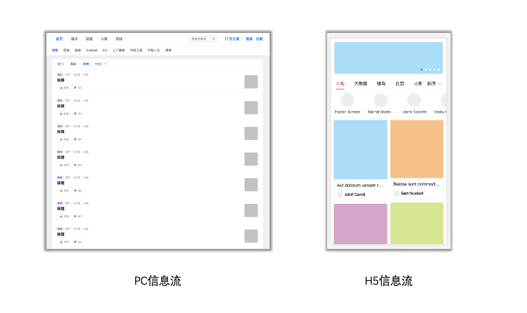

### 介绍

<Phone page="" />

#### Web前端可分为「业务型场景」和「非业务型场景」
- 业务型场景如：饿了么点餐、B+管理后台、淘宝电商平台…
- 非业务型场景如：游戏、大数据展示、同声传译、音视频处理…

#### 业务型场景可以划分为以下几种

#### 其中信息流场景如下所示
 

:::tip
`vue-listview`是信息流场景的一个抽象，它将帮助您维护列表的中间状态，以保持代码的整洁
:::

#### 特性
- 无需后端接口改造
- 自动维护列表的状态（`loading`、`error`、`nothing`、`no_more`）
- 自动无限滚动
- 提供列表的增删改查接口
- 支持服务端渲染
- 支持客户端缓存
